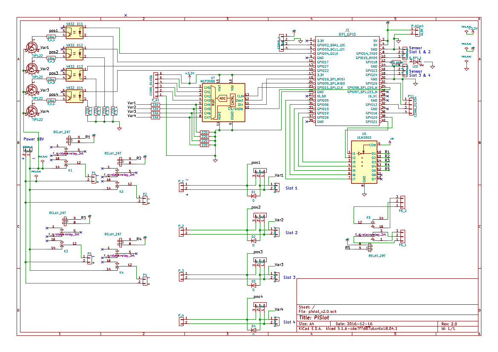
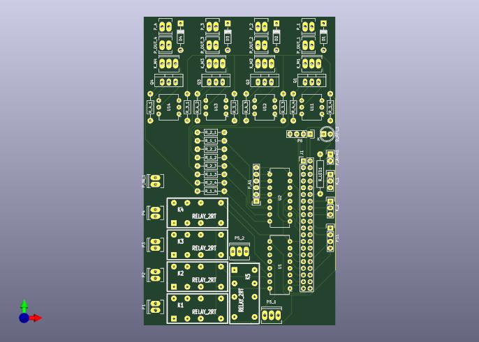

# PiSlot Raspberry Hat

## WARNING: NOT TESTED (yet)
The PiSlot Raspberry hat is not tested for the moment.

https://pislot.net

## Kicad electronic diagram

## Kicad PCB

## Libraries

You will probably have to use the following libraries:

- https://raw.githubusercontent.com/xesscorp/RPi_Hat_Template/master/RPi_Hat-cache.lib

